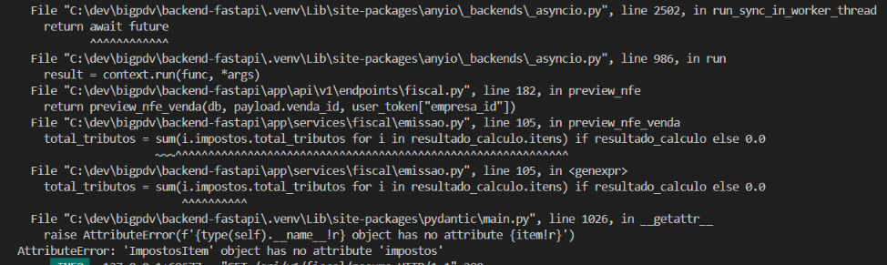

Atue como um Engenheiro de Software Sênior especialista em Python (FastAPI). 
Temos um problema no acesso ao schema ImpostosItem e inconsistências no visual da tela de emissão e gerenciamento da NF-e.

Preciso que olhe as necessidades abaixo e monte um plano de refatorção eficiente:

# 1- Problema lógico - acesso a itens não disponíveis

Preciso que corrija esse erro de acesso a atributos inexistentes, isso está quebrando a aplicação na emissão da NF-e.

# 2- Melhoria da tabela principal
A tabela principal está um pouco inconsistente com a proposta do sistema, recomendo que retire o quadro de pendênncias da lateral e amplie a tabela principal. Tente vincular o nome do destinatário da nota e deixa-la, em geral, melhor do que a atual. A ideia se consiste em melhorar um pouco os dados disponíveis para essa rápida visualização.

Nesse ponto preciso de sua ajuda nas seguintes dúvidas:
- Como podemos encaixar a tabela de pendências na mesma tela só que de uma forma mais reduzida? Ex: Podemos colocar um botão que abre todo esse status, junto com uma barrinha de progesso próximo ao botão que incetiva essa ação.
- Quais dados podemos colocar na tabela? Esses dados devem satisfazer o dia a dia do cliente, o intuíto é que eles consigam ver os mais importantes antes de abrir os detalhes.

# 3- Model de seleção de venda para NF-e
O modal de seleção também está bem desagradável, a seleção de venda está muito complicada com apenas um número da venda muito mal formatado. Tente dar mais foco no nome do cliente, numero da venda melhor e valor.

Me dê dicas de como pode ser feito aqui também

# 4- Mais detalhes sobre Status da NF-e
A tela está visualmente agradável, só quero saber se você tem algumas recomendações de melhoria.
